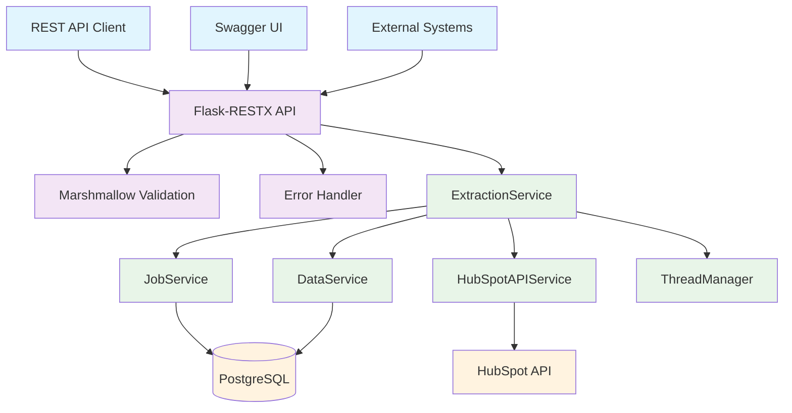
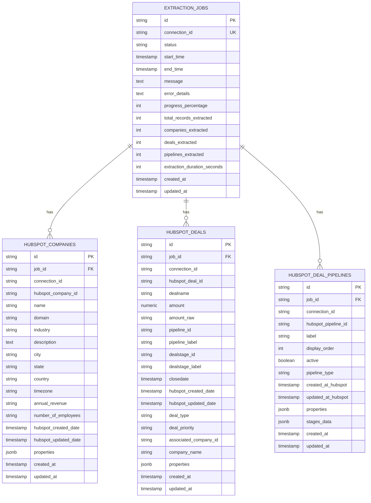
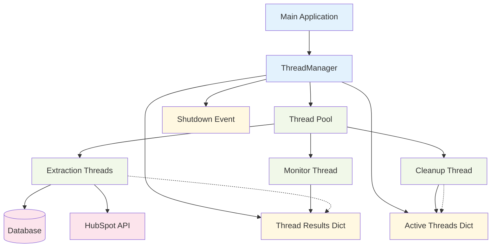
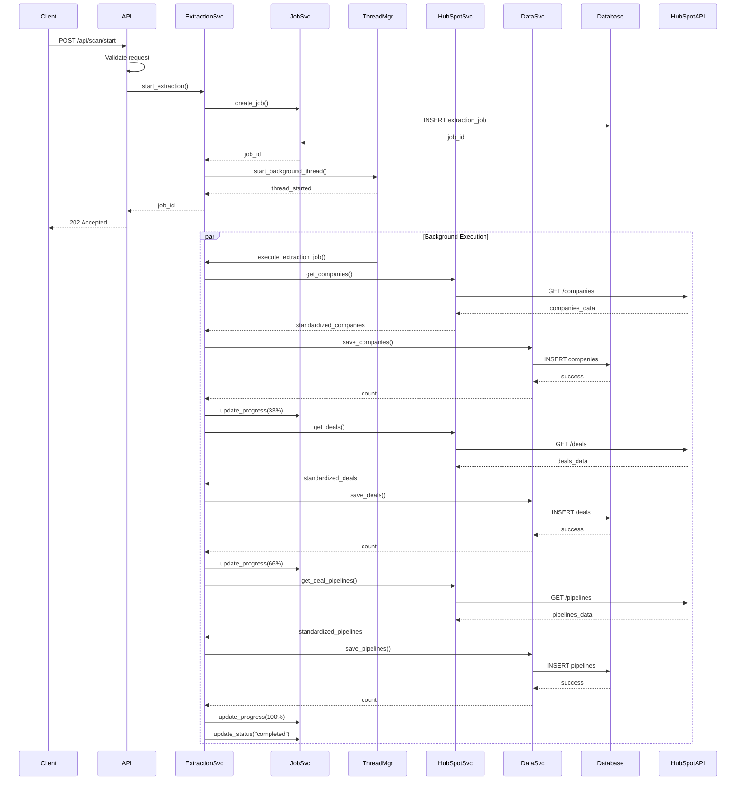
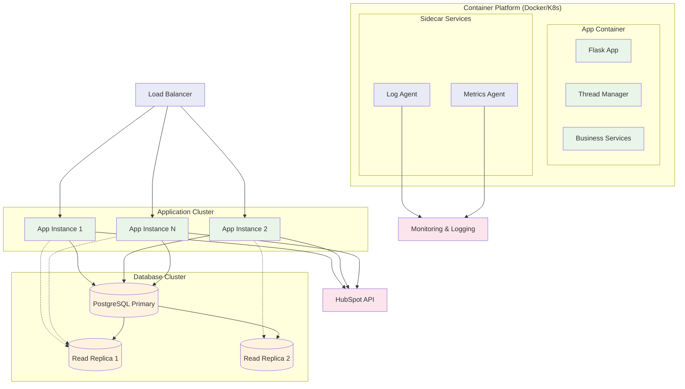
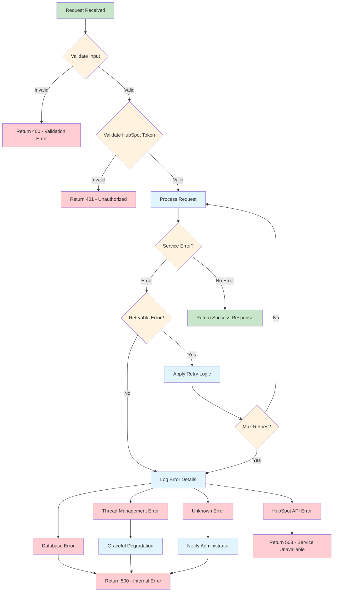

# HubSpot Data Extraction Service - System Architecture

## System Overview

The HubSpot Data Extraction Service is a robust, multi-threaded Flask application designed to efficiently extract, process, and store HubSpot CRM data. The system follows a microservices-inspired architecture with clear separation of concerns and comprehensive error handling.

## System Architecture Diagrams

### High-Level System Architecture

```
┌─────────────────────────────────────────────────────────────────┐
│                          CLIENT LAYER                           │
├─────────────────────────────────────────────────────────────────┤
│  • REST API Clients                                            │
│  • Swagger UI (Documentation)                                  │
│  • External Systems Integration                                │
└─────────────────────────────────────────────────────────────────┘
                                    │
                                    ▼
┌─────────────────────────────────────────────────────────────────┐
│                        API GATEWAY LAYER                        │
├─────────────────────────────────────────────────────────────────┤
│  • Flask-RESTX API Routes                                      │
│  • Request Validation (Marshmallow)                           │
│  • Error Handling & Response Formatting                        │
│  • CORS Configuration                                          │
│  • API Documentation Generation                                │
└─────────────────────────────────────────────────────────────────┘
                                    │
                                    ▼
┌─────────────────────────────────────────────────────────────────┐
│                       SERVICE LAYER                            │
├─────────────────────────────────────────────────────────────────┤
│  ┌─────────────────┐ ┌─────────────────┐ ┌─────────────────┐  │
│  │ ExtractionService│ │  JobService     │ │  DataService    │  │
│  │                 │ │                 │ │                 │  │
│  │ • Orchestration │ │ • Job Lifecycle │ │ • Data Storage  │  │
│  │ • Workflow Mgmt │ │ • Status Track  │ │ • Data Cleanup  │  │
│  │ • Thread Coord  │ │ • Progress Mgmt │ │ • Relationships │  │
│  └─────────────────┘ └─────────────────┘ └─────────────────┘  │
│                                    │                           │
│  ┌─────────────────┐ ┌─────────────────┐                      │
│  │ HubSpotAPIService│ │ ThreadManager   │                      │
│  │                 │ │                 │                      │
│  │ • API Integration│ │ • Concurrency   │                      │
│  │ • Rate Limiting │ │ • Resource Mgmt │                      │
│  │ • Error Handling│ │ • Thread Safety │                      │
│  └─────────────────┘ └─────────────────┘                      │
└─────────────────────────────────────────────────────────────────┘
                                    │
                                    ▼
┌─────────────────────────────────────────────────────────────────┐
│                      INTEGRATION LAYER                         │
├─────────────────────────────────────────────────────────────────┤
│  ┌─────────────────┐                ┌─────────────────┐        │
│  │   HubSpot API   │                │   PostgreSQL    │        │
│  │                 │                │                 │        │
│  │ • Companies API │                │ • ACID Txns     │        │
│  │ • Deals API     │                │ • Connection    │        │
│  │ • Pipelines API │                │   Pooling       │        │
│  │ • Rate Limiting │                │ • JSONB Storage │        │
│  └─────────────────┘                └─────────────────┘        │
└─────────────────────────────────────────────────────────────────┘
```

### Component Interaction Diagram



### Database Entity Relationship Diagram



### Thread Management Architecture



### Data Flow Sequence Diagram



### Deployment Architecture Diagram



### Error Handling Flow Diagram



## Core Components

### 1. API Gateway Layer

**Flask-RESTX Framework**
- RESTful API endpoints with automatic Swagger documentation
- Request/response validation using Marshmallow schemas
- Centralized error handling and HTTP status code management
- CORS support for cross-origin requests

**Key Endpoints:**
- `POST /api/scan/start` - Start extraction job
- `GET /api/scan/status/{job_id}` - Get job status
- `GET /api/scan/result/{job_id}` - Get extraction results
- `DELETE /api/scan/remove/{job_id}` - Delete job and data
- `POST /api/scan/{job_id}/cancel` - Cancel running job
- `GET /api/health` - System health check
- `GET /api/system/threads` - Thread management status

### 2. Service Layer Architecture

#### ExtractionService (Orchestrator)
```python
class ExtractionService:
    """Main orchestration service for HubSpot data extraction"""
    
    # Core Responsibilities:
    # - Workflow orchestration
    # - Thread coordination
    # - Job lifecycle management
    # - Error recovery
```

**Key Features:**
- **Multi-phase extraction workflow**: Companies → Deals → Pipelines
- **Concurrent processing**: Background thread execution
- **Status tracking**: Real-time progress updates
- **Error handling**: Comprehensive failure recovery
- **Job cancellation**: Graceful termination support

#### HubSpotAPIService (External Integration)
```python
class HubSpotAPIService:
    """Service for HubSpot API communication with robust error handling"""
    
    # Core Responsibilities:
    # - API token validation
    # - Paginated data retrieval
    # - Rate limiting compliance
    # - Data standardization
```

**Key Features:**
- **Rate limiting**: Intelligent backoff and retry logic
- **Pagination handling**: Automatic traversal of large datasets
- **Data normalization**: Consistent data structure across entities
- **Error resilience**: Retry mechanisms with exponential backoff
- **Performance optimization**: Concurrent request batching

#### JobService (Lifecycle Management)
```python
class JobService:
    """Service for managing extraction job lifecycle"""
    
    # Core Responsibilities:
    # - Job creation and tracking
    # - Status updates
    # - Progress monitoring
    # - Job cleanup
```

**Key Features:**
- **Status management**: Comprehensive job state tracking
- **Progress metrics**: Real-time extraction progress
- **Audit trails**: Complete job history
- **Cleanup utilities**: Automated old job removal

#### DataService (Persistence Layer)
```python
class DataService:
    """Service for processing and storing HubSpot data"""
    
    # Core Responsibilities:
    # - Data validation and cleaning
    # - Database persistence
    # - Relationship management
    # - Result retrieval
```

**Key Features:**
- **Data validation**: Input sanitization and type conversion
- **Batch processing**: Efficient bulk data operations
- **Relationship handling**: Foreign key management
- **JSON storage**: Flexible property storage using JSONB

### 3. Thread Management System

#### ThreadManager (Concurrency Control)
```python
class ThreadManager:
    """Centralized thread management for concurrent operations"""
    
    # Core Responsibilities:
    # - Thread lifecycle management
    # - Resource allocation
    # - Concurrent task execution
    # - Graceful shutdown
```

**Architecture Features:**
- **Thread pooling**: Configurable worker thread limits
- **Cooperative shutdown**: Graceful termination signals
- **Resource monitoring**: Thread health and performance tracking
- **Memory management**: Automatic cleanup of completed threads
- **Statistics collection**: Performance metrics and reporting

## Data Flow Architecture

### 1. Extraction Workflow

```
┌─────────────┐    ┌─────────────┐    ┌─────────────┐    ┌─────────────┐
│   Request   │───▶│ Validation  │───▶│ Job Creation│───▶│Thread Start │
│ Validation  │    │ & Auth      │    │             │    │             │
└─────────────┘    └─────────────┘    └─────────────┘    └─────────────┘
                                                                 │
                                                                 ▼
┌─────────────┐    ┌─────────────┐    ┌─────────────┐    ┌─────────────┐
│   Result    │◀───│   Data      │◀───│   HubSpot   │◀───│ Background  │
│   Storage   │    │ Processing  │    │ API Calls   │    │ Execution   │
└─────────────┘    └─────────────┘    └─────────────┘    └─────────────┘
```

### 2. Data Processing Pipeline

```
HubSpot API Response
         │
         ▼
┌─────────────────┐
│ Data Validation │
│ & Normalization │
└─────────────────┘
         │
         ▼
┌─────────────────┐
│   Type Conversion│
│   & Cleaning    │
└─────────────────┘
         │
         ▼
┌─────────────────┐
│ Relationship    │
│ Resolution      │
└─────────────────┘
         │
         ▼
┌─────────────────┐
│ Database        │
│ Persistence     │
└─────────────────┘
```

## Database Architecture

### 1. Entity Relationship Model

```
extraction_jobs (Parent)
    │
    ├── hubspot_companies (Child)
    ├── hubspot_deals (Child)
    └── hubspot_deal_pipelines (Child)
```

**Key Design Principles:**
- **Cascade relationships**: Automatic cleanup on job deletion
- **JSONB storage**: Flexible property storage for extensibility
- **Strategic indexing**: Optimized for common query patterns
- **Connection pooling**: Thread-safe database access

### 2. Data Consistency Model

**ACID Compliance:**
- **Atomicity**: Complete transactions or rollback
- **Consistency**: Foreign key constraints and data validation
- **Isolation**: Thread-safe session management
- **Durability**: Persistent storage with backup considerations

## Configuration Management

### Environment-Based Configuration

```python
# Development Environment
class DevelopmentConfig(BaseConfig):
    DEBUG = True
    LOG_LEVEL = 'DEBUG'
    DATABASE_URL = 'postgresql://dev_db'

# Production Environment  
class ProductionConfig(BaseConfig):
    DEBUG = False
    LOG_LEVEL = 'WARNING'
    DATABASE_URL = 'postgresql://prod_db'
```

**Configuration Categories:**
- **Database settings**: Connection strings and pooling
- **API configuration**: Timeout and retry parameters
- **Threading limits**: Concurrency and resource allocation
- **Logging levels**: Environment-appropriate verbosity
- **HubSpot integration**: API endpoints and properties

## Security Architecture

### 1. Authentication & Authorization

**API Token Validation:**
- HubSpot API token verification on each request
- Token validation with test API calls
- Secure token storage in request headers
- No token persistence in system storage

### 2. Input Validation

**Multi-layer validation:**
```python
Request → Marshmallow Schema → Business Logic → Database Constraints
```

**Validation Features:**
- **Schema validation**: Marshmallow-based request validation
- **SQL injection prevention**: Parameterized queries with SQLAlchemy
- **Input sanitization**: Data cleaning and type conversion
- **Connection ID validation**: Regex-based format enforcement

### 3. Error Handling Security

**Information disclosure prevention:**
- Generic error messages for external users
- Detailed logging for internal debugging
- Sensitive information redaction
- Stack trace limitation in production

## Scalability Considerations

### 1. Horizontal Scaling

**Stateless design:**
- No in-memory state dependencies
- Database-backed job tracking
- Thread-local session management
- Load balancer compatible

**Database scaling:**
- Connection pooling for multiple instances
- Read replica support for analytics
- Partitioning strategies for large datasets
- Index optimization for query performance

### 2. Performance Optimization

**Caching strategies:**
- Database query optimization
- Connection pool reuse
- Efficient data structure usage
- Memory management best practices

**Concurrent processing:**
- Thread pool management
- Asynchronous HubSpot API calls
- Batch data processing
- Resource-aware task scheduling

## Monitoring & Observability

### 1. Health Monitoring

**Health check endpoints:**
- Database connectivity verification
- Thread manager status
- Active extraction monitoring
- Resource utilization tracking

### 2. Logging Architecture

**Structured logging:**
```python
# Hierarchical log levels
DEBUG    # Development debugging
INFO     # General operation info  
WARNING  # Non-critical issues
ERROR    # Critical failures
```

**Log categories:**
- **Application logs**: Business logic and workflow
- **API logs**: Request/response tracking
- **Database logs**: Query performance and errors
- **Thread logs**: Concurrency and resource management

### 3. Metrics Collection

**Performance metrics:**
- Extraction job success rates
- API response times
- Database query performance
- Thread utilization statistics
- Memory usage patterns

## Deployment Architecture

### 1. Container Strategy

**Docker containerization:**
```dockerfile
# Multi-stage build
FROM python:3.9-slim
COPY requirements.txt .
RUN pip install -r requirements.txt
COPY . .
EXPOSE 3012
CMD ["python", "app.py"]
```

### 2. Environment Management

**Configuration injection:**
- Environment variables for secrets
- Config file mounting for complex settings
- Service discovery for database connections
- Secret management integration

### 3. Process Management

**Application lifecycle:**
- Graceful startup with database initialization
- Health check integration
- Graceful shutdown with thread cleanup
- Signal handling for container orchestration

## Error Recovery & Resilience

### 1. Failure Modes

**System resilience patterns:**
- **Circuit breaker**: HubSpot API failure protection
- **Retry logic**: Exponential backoff for transient failures
- **Graceful degradation**: Partial success handling
- **Cleanup procedures**: Resource cleanup on failures

### 2. Data Integrity

**Consistency mechanisms:**
- **Transaction boundaries**: Atomic data operations
- **Foreign key constraints**: Referential integrity
- **Validation layers**: Multi-level data validation
- **Audit trails**: Complete operation tracking

## Future Architecture Considerations

### 1. Event-Driven Architecture

**Potential enhancements:**
- Message queue integration (Redis/RabbitMQ)
- Event sourcing for audit trails
- Webhook support for real-time updates
- Pub/sub patterns for decoupling

### 2. Microservices Evolution

**Service decomposition:**
- Dedicated HubSpot integration service
- Separate job management service  
- Independent data processing service
- Centralized configuration service

### 3. Advanced Features

**Enhancement roadmap:**
- Real-time streaming extraction
- Delta synchronization
- Multi-tenant support
- Advanced analytics integration
- Machine learning pipeline integration

This architecture provides a solid foundation for reliable, scalable HubSpot data extraction with comprehensive error handling, monitoring, and maintenance capabilities.